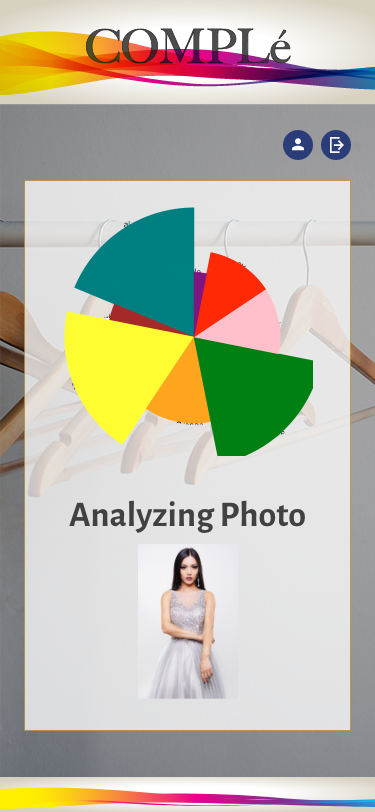
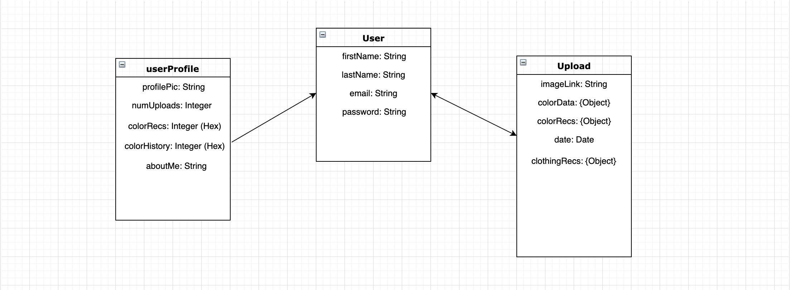
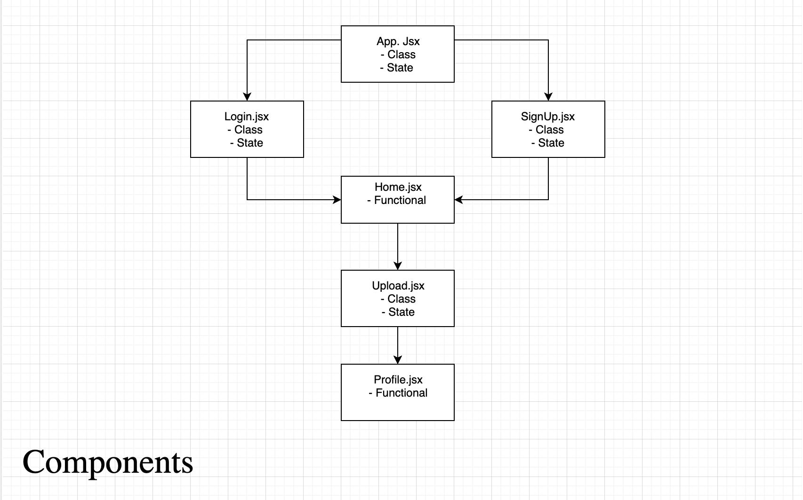

# mernProject

## Full MERN stack project

#### Developers:

Owen R. James,
Mickey Cowan,
Kenneth Hong

## About the App

Complé is an app that recommends complimentary colors for your outfit. Users can upload an image, and receive a collection of complimentary colors to add to that outfit.

### User Stories/Personae

- Ken can't decide what to decide to wear to an upcoming event. He knows he wants to wear his favorite blue shirt. However, he has no idea what goes well with it. Stylistically challenged, Ken decides to use Compléto get complementary colors for potential outfits. He goes to the event, receives many compliments.

- Karen is an interior designer. She see's a room and knows she wants to add accents to the curtains and other part of it. She takes a picture of the room, and using Complement's intelligent algorithm she receives a variety of different color options. The room is vivacious, the client gives her many compliments.

- Carlo is working on his car. He's more of a nuts and bolts guy, but wants to work on the interior. He snaps a photo of his car's interior, and uses Compléto find a spectrum of colors that shifts his design to a higher gear. Carlo now has the perfect color for his stitching accents, his wife is pleased, and pays him many compliments.

### Under the Hood

#### Technologies Used:

- React
- React Router
- mongoDB
- node.js
- mongoose
- axios
- bcrypt
- dotenv
- express
- express-jwt
- express-rate-limit
- express-form-data
- helmet
- jsonwebtoken
- react-bootstrap
- react-vis
- fontawesome
- cors

## Project Timeline

### Planning

- Discussed app ideas
- Researched API's
- [Trello Board](https://trello.com/b/KzDYzqsH/project-3-wdi)
- [Wireframing](https://xd.adobe.com/spec/8f4f013d-ffe9-4e2a-6a21-dbe328a2932d-f97e/)

## WireFraming

We created wireframes in Adobe XD and made an interactive UI.

<div style="float: left; margin: 0px 0px 20px 20px;">Login Page:<br>
  </div>
<div style="float: left; margin: 0px 0px 20px 20px;">Signup Page:<br>
  </div>
<div style="float: left; margin: 0px 0px 20px 20px;">Home Page:<br>
  </div>
<div style="float: left; margin: 0px 0px 20px 20px;">Analysis:<br>
  </div>
    <br style="clear:both" />
<div style="float: left; margin: 0px 0px 20px 20px;">Save Complé:<br>
  </div>
<div style="float: left; margin: 0px 0px 20px 20px;">Profile Create:<br>
  </div>
<div style="float: left; margin: 0px 0px 20px 20px;">Show Profile:<br>
  </div>
<div style="float: left; margin: 0px 0px 20px 20px;">Complé Collection:<br>
  </div>
    <br style="clear:both" />

## API

We decided to use The Color API which gives you options of colors to output given an input color in either hex or rgb format. The options were:
*monochrome
*monochrome-dark
*monochrome-light
*analogic
*complement
*analogic-complement
*triad
*quad
We decided that allowing the user to select between these would be perfect.

## Back-end Planning

### Entity Relationship Diagram

- Link to the Entity Relationship Diagram made with <a href="https://www.draw.io/?libs=general;uml"> Draw.io </a>.

- Screenshot of the Entity Relationship Diagram:
  

###  Routes 

| Method | Route | 
|--------|-------|
| POST   | /login | 
| POST   | /signup | 
| POST   | /me/from/token | 
| GET    | /cloudinary-data/:pid | 
| GET    | /profile/:userId/uploads |
| GET    | /profile/:userId/uploads/:uid |
| POST   | /profile/:userId/uploads |
| DELETE | /profile/upload/delete | 

### Getting the Cloudinary API to Jive

We found a useful method in the cloudinary API that would analyze photos for colors. However, getting this API to function was a non-trivial task. I set out to create a test app with the sole purpose of attaining color information from a given picture. I made an express app using mongoose as the (Object Document Mapper) ODM for MongoDB.

I required the packages necessary to use the most basic functionality of this test app.

```javascript
const express = require('express');
const app = express();
const cloudinary = require('cloudinary');
require('dotenv').config();
const mongoose = require('mongoose');

mongoose.connect('mongodb://localhost/test', { useNewUrlParser: true });
app.use(express.urlencoded({ extended: false }));
```

Next, I had to configure the cloudinary package needed to access cloudinary to my specific API key and API secret which I stored in my .env file.

```javascript
cloudinary.config({
  cloud_name: 'orjames',
  api_key: process.env.REACT_APP_CLOUDINARY_API_KEY,
  api_secret: process.env.REACT_APP_CLOUDINARY_API_SECRET,
});
```

next I added a get simple GET route to access the cloudinary API analysis tools and set colors to true to output the color data from the image. The resulting JSON object would oupput the picture color information we needed. Success!

```javascript
//creating the test route
app.get('/cloudinary-data', function(req, res) {
  console.log('in get route');
  cloudinary.v2.api.resource('Owen_-_City_-_Small', { colors: true }, function(
    error,
    result
  ) {
    res.json(result);
  });
});
```


## Front-end Planning

### Components

- Screenshot of the components:
  

## App Development
The main functionality of the app, when simplified, is three components: the upload/image analysis widget, the data visualization and the recommendations.

### Image Analysis & Upload
This was the crux of our app, to get the upload functionality working, I built a custom widget based on cloudinary. This ended up being a massive time sink, and the most difficult part of the app. A LOT more was involved but an the code that does the analyis is shown below

Front End:
```javascript
getPhotoData = () => {
    axios
      .get(`/index/cloudinary-data/${this.state.images[0].public_id}`)
      .then((res) => {
        this.setState({
          cloudColors: res.data.colors,
        });
      });
  };
```
Back End:
```javascript
router.get('/cloudinary-data/:pid', function(req, res) {
  cloudinary.v2.api.resource(
    req.params.pid,
    { colors: true, quality_analysis: true },
    function(error, result) {
      res.json(result);
    }
  );
});
```

### Data Visualization 
React-vis is a React visualization library created by Uber. With it you can easily create common charts, such as line, area, bar charts, pie and donut charts, tree maps and many more. We are using React-vis to display the color hex data from the image and also the percentage of promienence it holds. From here the user can see the color data. 

- Code Snippet:


- React Vis Example:


### Recommendations
Recommedations required me to use another API - humbly named The Color API. This took an input of one color and returned complementary colors depending on some parameters selected. This was fairly smooth sailing, and I was able to do it all on the front end. The string template literal used to access the URI is shown below.
```javascript
let colorApi = `http://www.thecolorapi.com/scheme?hex=${primaryColorHex}&format=json&mode=complement&count=6`;
```

## Back End Routes
I wanted to allow the user to be able to post to their uploads (comple's) to their profile, this meant a handfull of routes written in the profile.js routes file. The trick was getting axios from the front end to call the routes from back end. Here's what our post route  ( // POST /profile/:userId/uploads ) looks like:

The axios call lives in the Recommendations component:
```javascript
postUpload = (object) => {
    console.log('axios should e posting this');
    axios
      .post(`/profile/${object.userId}/uploads`, {
        publicId: object.publicId,
        cloudColors: object.cloudColors,
        colorRec: object.colorRec,
        date: object.date,
      })
      .then((res) => {
        console.log(res);
      })
      .catch(function(error) {
        console.log(error);
      });
  };
  ```

The POST route lives in the profile.js route file:
```javascript
// POST /profile/:userId/uploads - POST an upload associated with given user
router.post('/:userId/uploads', (req, res) => {
  User.findById(req.params.userId).then((user, err) => {
    let newUpload = new Upload({
      publicId: req.body.publicId,
      cloudColors: req.body.cloudColors,
      colorRec: req.body.colorRec,
      date: req.body.date,
    });
    newUpload.save((err, upload) => {
      user.uploads.push(upload);
      user.save((err, user) => {
        res.status(201).json(user);
      });
    });
  });
});
```


#### Image Attribution
Link to spectrum image
<a href="https://www.freepik.com/free-photos-vectors/background">Background vector created by starline - www.freepik.com</a>

Link to 2nd spectrum image
<a href="https://www.freepik.com/free-photos-vectors/background">Background vector created by pinnacleanimates - www.freepik.com</a>
